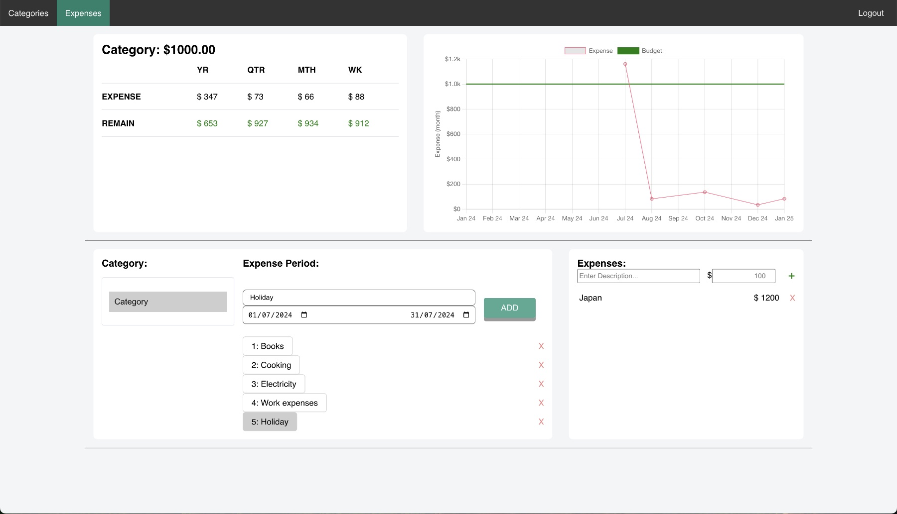

# Expense Tracker



Is your discretionary spending creeping up? Do you even know how much you’re spending on Uber Eats per month? I know what you’re thinking -> I’ll track my expenses. Really? Will you spend hours per week listing out each of your expenses and laboriously putting it into that clunky spreadsheet?

Fear not!! Enter as little or as much expenses as you like. We’ll crunch the numbers and figure out your average expenses. We’ll give you monthly averages over weeks, months and years. We’ll show you a nice chart so you can see things visually also!!

## Technology

- React JS
- Python Django
- Docker
- Nginx
- SQLite

## Get Started

- Seed a DB

```bash
python3 -m venv venv
source venv/bin/activate
pip install -r requirements.txt
python manage.py migrate
```

- Add a `.env` file to the root folder with a SECRET_KEY and DEBUG set to TRUE

```bash
echo "SECRET_KEY=$(openssl rand -base64 32)" > .env
echo "DEBUG=TRUE" >> .env
```

- Install app

```bash
docker compose build
docker compose up
```

how to set up postgres in python.config
https://www.1strategy.com/blog/2017/05/23/tutorial-django-elastic-beanstalk/
linux extras
https://stackoverflow.com/a/63204453
Change to t3 micro in command line
eb create --single -db -db.engine postgres -db.i db.t3.micro
Change namespace for staticfiles to
https://stackoverflow.com/a/63156811
Change how you run migrate
https://stackoverflow.com/a/63074854

## Progress

Visit the live website on:
[https://web-expense-tracker.herokuapp.com/](https://web-expense-tracker.herokuapp.com/)

- [x] Sign up with email and password\n
- [x] Enter your expenses and watch the totals increase\n
- [x] Store the type of expense and/or allow filtering by type\n
- [x] Connect to Django Database
- [x] Allow deleting records without refreshing whole page
- [x] Add formsets, to add multiple expenses at one time.
- [x] Add logic to estimate your expenses per month, and a top summary bar.
- [ ] Add diagrams showing history of expense

# Integrated Django & React App

React has been integrated into the Django App.
Refer post https://dev.to/shakib609/deploy-your-django-react-js-app-to-heroku-2bck for details.

# Development

- Run `python manage.py runserver` in the root directory
- For now, you need to authenticate via the standard Django server localhost:8000/
- Then for hot reloading, run `cd reactapp; npm start` and navigate to localhost:3000

# Get EB cli on path

Note: To complete installation, ensure `eb` is in PATH. You can ensure this by executing:

    1. Bash:

       echo 'export PATH="/home/lisitsa/.ebcli-virtual-env/executables:$PATH"' >> ~/.bash_profile && source ~/.bash_profile

    2. Zsh:

       echo 'export PATH="/home/lisitsa/.ebcli-virtual-env/executables:$PATH"' >> ~/.zshenv && source ~/.zshenv

# Add yourself as user to the the EC2 instance

https://www.digitalocean.com/community/questions/how-to-fix-docker-got-permission-denied-while-trying-to-connect-to-the-docker-daemon-socket
